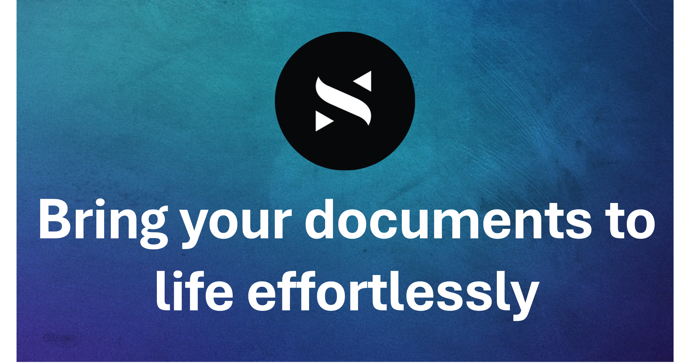

# Scroll - PDF Chatbot Web App



Scroll is a PDF Chatbot Web application built using modern technologies like NextJs, React, Tailwind, tRPC, Prisma, and OpenAI. It allows users to upload PDFs and query them through a chatbot interface.

## Features

- **Chatbot Interface**: Interact with your PDF documents using a chatbot powered by OpenAI.
- **Text Analysis**: Analyze text within PDFs, providing a more comprehensive understanding of the document content.
- **User-Friendly Design**: Built with NextJs and Tailwind CSS for a responsive and intuitive user experience.
- **Scalable Architecture**: Utilizing tRPC for seamless backend integration and Prisma for efficient database management.

## Technologies Used

- **Frontend**: NextJs, React, Tailwind CSS
- **Backend**: tRPC, Prisma
- **AI Model**: OpenAI API for natural language processing
- **Database**: Prisma for database management

## Getting Started

To get started with this project, run
   ```bash
   git clone https://github.com/DanishKhan1811/scroll.git
   ```
and copy the .env.example variables into a separate .env file, fill them out & and that's all you need to get started!
